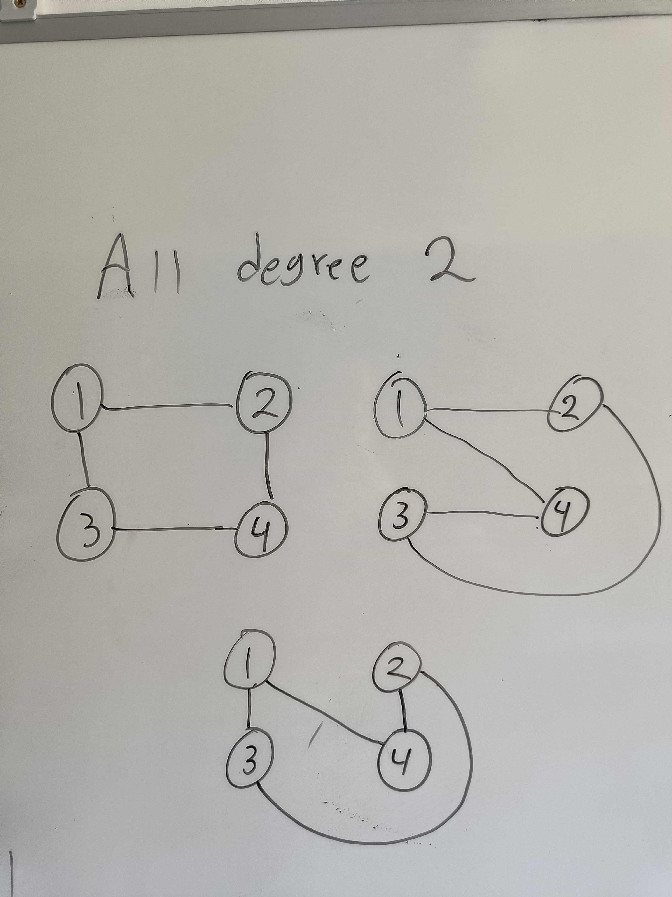
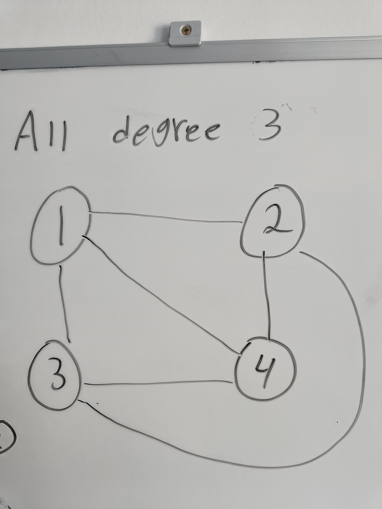

***Rita alla enkla sammanhängande grafer med hörnen 1,2,3,4, där samtliga hörn har gradtal 1.***

Enligt gradsumma-satsen1 är den totala summan av alla hörn v:s gradtal lika med 2 gånger antalet kanter E, detta
ger i detta fall:

&Sigma;deg(v)=4 * 1=4=2 * |E| &rarr; |E|=2

Detta säger att antalet kanter måste vara två om samtliga hörn ska ha gradtal ett. Vidare är
det är omöjligt att skapa en sammanhängande graf
med fyra hörn med endast två kanter. Det finns alltså inga enkla sammanhängande grafer med hörnen 1,2,3,4 där samtliga
hörn har gradtal 1.

***Rita alla enkla sammanhängande grafer med hörnen 1,2,3,4, där samtliga hörn har gradtal 2.***

Detta motsvarar att varje hörn är direkt sammankopplad (avstånd ett) via kanter till två andra hörn. Det finns tre unika
sätt att göra det:

***Rita alla enkla sammanhängande grafer med hörnen 1,2,3,4, där samtliga hörn har gradtal 3.***

Detta motsvarar att alla hörn är direkt sammankopplade med alla andra med en kant, det vill säga att avståndet mellan alla
hörn är ett. Detta går att göra på precis ett sätt:

### Källor:
1. https://en.wikipedia.org/wiki/Degree_(graph_theory)