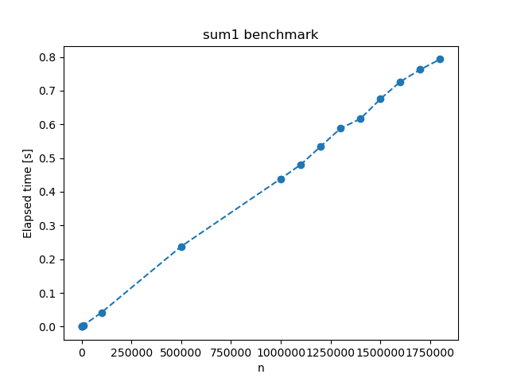

### Tidskomplexitet för rekursiva funktioner:

***Teori:*** Beräkna tidskomplexiteten för funktionerna <code>pow</code>, <code>sum1</code> och <code>sum2</code>.\
Anmärkning: I samtliga fall nedan låter vi <i>T(n)</i> beteckna antalet elementära operationer som utförs vid anropen pow(n), sum1(a), sum2(a),
där listan a har n element.
Funktionerna <i>T(n)</i> kommer ha strukturen <i>T(n)</i> = (konstant antal operationer) + (rekursiva anrop),
<i>T(n)</i> = (funktion av n antal operationer) + (rekursiva anrop), eller i basfallen
<i>T(n)</i> = (konstant antal operationer). Då vi söker den asymptotiska tidskomplexiteten kommer jag i beräkningarna nedan låta
(konstant antal operationer) = 1, (funktion av n som är &Theta;(n) antal operationer) = n och
(funktion av n som är &Theta;(n2) antal operationer) = n2 osv.

***pow:*** 
<pre><code>def pow(n):
	"""Return 2**n, where n is a nonnegative integer."""
	if n == 0:
		return 1
	x = pow(n//2)
	if n%2 == 0:
		return x*x
	return 2*x*x
</code></pre>
Låt\
<i>(1) T(0) = 1\
(2) T(n) = 1 + T(n//2)</i>\
Vi beräknar tidskomplexiteten med upprepad substitution:\
<i>T(n) = {(2)} = 1 + T(n//2) = {(2)} = 2 + T(n//4) = {(2)} = 3 + T(n//8) = ...\
= k + T(n//2(k)) = ... = log2(n) + 1 + T(n//2log2(n)+1) = log2(n) + 1 + T(0) =
 {(1)} = log2(n) + 2 
= &Theta;(log2(n))
</i>

Svar: Tidskomplexiteten för <code>pow</code> är <i>&Theta;(log2(n))</i>

***sum1:*** 
<pre><code>def sum1(a):
	"""Return the sum of the elements in the list a."""
	n = len(a)
	if n == 0:
		return 0
	if n == 1:
		return a[0]
	return sum1(a[:n//2]) + sum1(a[n//2:])
</code></pre>
Låt\
<i>(1) T(0) = 1\
(2) T(1) = 1\
(3) T(n) = n + 2T(n/2)</i>\
Här noterar vi att de 2 rekursiva anropen egentligen görs med listor som har storlek floor(n/2) och ceil(n/2) men
då vi söker den asymptotiska tidskomplexiteten bryr vi oss ej om det. Dessutom gäller det att
slicing [ : ] tar linjär tid i python och därav följer n:et i (3).
Vi beräknar tidskomplexiteten med upprepad substitution:\
<i>T(n) = {(3)} = n + 2T(n/2) = {(3)} = 2n + 4T(n/4) = {(3)} = 3n + 8T(n/8) = ...\
= k*n + 2kT(n/2(k)) = ... = n log2(n) + 2log2(n)T(n/2log2(n))
= n log2(n) + nT(1) =
 {(2)} = n log2(n) + n = &Theta;(n log2(n))
</i>

Svar: Tidskomplexiteten för <code>sum1</code> är <i>&Theta;(n log2(n))</i> 

***sum2:*** 

<pre><code>def sum2(a):
	"""Return the sum of the elements in the list a."""
	return _sum(a, 0, len(a)-1)

def _sum(a, i, j):
	"""Return the sum of the elements from a[i] to a[j]."""
	if i > j:
		return 0
	if i == j:
		return a[i]
	mid = (i+j)//2
	return _sum(a, i, mid) + _sum(a, mid+1, j)
</code></pre>

Låt <i>T(n)</i> nu även beteckna anropet till hjälpfunktionen _sum(a, i, j), där n = j - i + 1 = {vid det första anropet} = len(a)
<i> och \
(1) T(0) = 1\
(2) T(1) = 1\
(3) T(n) = 1 + 2T(n/2)</i>\
Här noterar vi att de 2 rekursiva anropen egentligen görs med listor som har storlek floor(n/2) och ceil(n/2) men
då vi söker den asymptotiska tidskomplexiteten bryr vi oss ej om det. 
Vi beräknar tidskomplexiteten med upprepad substitution:\
<i>T(n) = {(3)} = 1 + 2T(n/2) = {(3)} = 3 + 4T(n/4) = {(3)} = 7 + 8T(n/8) = ...\
= 2k - 1 + 2kT(n/2(k)) = ... = 2log2(n) - 1 + 2log2(n)T(n/2log2(n)) = n - 1 + nT(1) =
 {(2)} = 2n-1 = &Theta;(n)
</i>

Svar: Tidskomplexiteten för <code>sum1</code> är <i>&Theta;(n)</i>

***Praktik***:

<code>pow</code>

| n       | Elapsed Time [s]       |
|---------|------------------------|
| 10      | 2.1457672119140625e-06 |
| 100     | 2.384185791015625e-06  |
| 1000    | 3.337860107421875e-06  |
| 10000   | 1.8358230590820312e-05 |
| 100000  | 0.00021076202392578125 |
| 500000  | 0.0014433860778808594  |
| 1000000 | 0.0028944015502929688  |
| 1100000 | 0.00264739990234375    |
| 1200000 | 0.0027806758880615234  |
| 1300000 | 0.003149747848510742   |
| 1400000 | 0.0035207271575927734  |
| 1500000 | 0.0039827823638916016  |
| 1600000 | 0.004345893859863281   |
| 1700000 | 0.004776716232299805   |
| 1800000 | 0.005143404006958008   |

För n = 10,100,1000 så verkar tiden öka långsammare än linjärt
men för större n ökar tiden ungefärligt linjärt.

<code>sum1</code>

| n       | Elapsed Time [s]       |
|---------|------------------------|
| 10      | 1.5735626220703125e-05 |
| 100     | 4.029273986816406e-05  |
| 1000    | 0.0003688335418701172  |
| 10000   | 0.004065513610839844   |
| 100000  | 0.041826486587524414   |
| 500000  | 0.23789310455322266    |
| 1000000 | 0.4388892650604248     |
| 1100000 | 0.4806365966796875     |
| 1200000 | 0.5345454216003418     |
| 1300000 | 0.5881228446960449     |
| 1400000 | 0.6166830062866211     |
| 1500000 | 0.6753535270690918     |
| 1600000 | 0.7266840934753418     |
| 1700000 | 0.762639045715332      |
| 1800000 | 0.7933509349822998     |

Tiden verkar öka linjärt.

<code>sum2</code>

| n       | Elapsed Time [s]       |
|---------|------------------------|
| 10      | 1.4543533325195312e-05 |
| 100     | 4.506111145019531e-05  |
| 1000    | 0.0002567768096923828  |
| 10000   | 0.002675294876098633   |
| 100000  | 0.031341552734375      |
| 500000  | 0.13327789306640625    |
| 1000000 | 0.2753877639770508     |
| 1100000 | 0.29982662200927734    |
| 1200000 | 0.32873034477233887    |
| 1300000 | 0.362778902053833      |
| 1400000 | 0.36557483673095703    |
| 1500000 | 0.41019296646118164    |
| 1600000 | 0.43015217781066895    |
| 1700000 | 0.4462299346923828     |
| 1800000 | 0.4748401641845703     |

Tiden verkar öka linjärt.

***Diskussion***:

Allmänt finns det ett flertal faktorer som bidrar till skillnader mellan praktik och teori när det kommer till 
exekveringstider och tidskomplexitet, här följer några exempel.

Teoretiskt beräknar vi den asymptotiska tidskomplexiteten, dvs vi undersöker
tidskomplexiteten då n &rarr; &infin;. I praktiken arbetar vi alltid med finita n och därför kan beteendet se mycket
annorlunda ut helt enkelt för att vi har för små n. Teoretiskt bryr vi oss dessutom endast om vilken
ordning tidskomplexiteten är och vi ignorerar eventuella konstanter och termer som "försvinner" i oändligheten. 
Detta kan också medföra stora skillnader jämfört med praktiken. T.ex kan konstanter och det faktum att vi i praktiken undersöker
finita n göra så att en logaritmisk funktion ser linjär ut. En annan faktor är att det alltid finns en slump inblandad i praktiska
"benchmarks" för att våra datorer ej utför en konstant mängd operationer per tid utan det kan variera från en körning till en annan.
Sedan är det i allmänhet svårt att avgöra om ett antal datapunkter liknar en viss funktion. 
 

När det kommer till benchmarksen till denna uppgift stämmer praktiken bra överens för 
sum1 och sum2 funktionerna. Benchmark-datan för dessa verkar växa linjärt vilket passar med de teoretiska 
tidskomplexiteterna n log(n) och n, just för att det är svårt att se skillnad på
en n log(n) funktion och en linjär funktion. 

Att förklara varför tiden för pow verkar växa linjärt i praktiken trots att den teoretiska tidskomplexiteten är 
logaritmisk är svårare. Tiden verkar växa långsammare för små n, potentiellt finns det någon faktor som inte tas hänsyn till 
i den teoretiska tidskomplexitetsberäkningen som ökar exekveringstiden för större n. Eller så är det några av de allmänna 
skillnaderna mellan praktik och teori som jag diskuterade ovan som ställer till det. 

